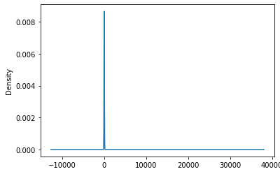

# Neural_Network_Charity_Analysis

## Overview

This project uses a .csv with over 34,000 organizations that received funding from Alphabet Soup.  The goal was to develop a neural network to project if organizations would be successful if given funding in future projects. The second part of the project was optimizing that network to achieve at least 75% accuracy.

## Process and Results

### Data Preprocessing

- The target variable for the model is whether the organization used the money successfully (IS_SUCCESSFUL).

- The features for the model were:
  - APPLICATION_TYPE—Alphabet Soup application type
  - AFFILIATION—Affiliated sector of industry
  - CLASSIFICATION—Government organization classification
  - USE_CASE—Use case for funding
  - ORGANIZATION—Organization type
  - STATUS—Active status
  - INCOME_AMT—Income classification
  - SPECIAL_CONSIDERATIONS—Special consideration for application
  - ASK_AMT—Funding amount requested

- Columns removed from analysis were: EIN and NAME—Identification columns

- The APPLICATION_TYPE column was binned based on value counts with anything less than 500 being reclassified as "other".

- The CLASSIFICATION column was binned based on value counts with anything less than 1500 being reclassified as "other".

- Values were encoded using OneHotEncoder and the dataframes were merged.

- X and y values were set and scaled.

### Compiling, Training, and Evaluating the Model

- The original neural network had 2 hidden layers, the first with 80 neurons and the second with 30 neurons.  Both layers used Relu activation and the output layer was sigmoid. It was fit to the model, ran for 100 epochs with checkpoints saved every 5 epochs. This model had a loss of ~56% and an accuracy of ~72%.

<figcaption align = "center"><b></b></figcaption> 

<figcaption align = "center"><b></b></figcaption> 

- The first try at optimization had 3 hidden layers, the first with 80 neurons, the second with 30 neurons, and the third with 10 neurons.  All layers used Relu activation and the output layer was sigmoid. It was fit to the model, ran for 100 epochs with checkpoints saved every 5 epochs. This model had a loss of ~56% and an accuracy of ~73%.

<figcaption align = "center"><b></b></figcaption>
<figcaption align = "center"><b></b></figcaption>

- The second try at optimization had 3 hidden layers, the first with 80 neurons, the second with 30 neurons, and the third with 10 neurons.  All layers used Tanh activation and the output layer was sigmoid. It was fit to the model, ran for 100 epochs with checkpoints saved every 5 epochs. This model had a loss of ~55% and an accuracy of ~73%.

<figcaption align = "center"><b></b></figcaption>
<figcaption align = "center"><b></b></figcaption>

- The third try at optimization had 3 hidden layers, the first with 100 neurons, the second with 60 neurons, and the third with 30 neurons.  The first two layers used Relu activation, the third used Tanh and the output layer was sigmoid. It was fit to the model, ran for 200 epochs with checkpoints saved every 5 epochs. This model had a loss of ~56% and an accuracy of ~73%.

<figcaption align = "center"><b></b></figcaption>
<figcaption align = "center"><b></b></figcaption>

- The fourth try at optimization had 3 hidden layers, the first with 200 neurons, the second with 100 neurons, and the third with 50 neurons.  The first two layers used Relu activation, the third used Tanh and the output layer was sigmoid. It was fit to the model, ran for 200 epochs with checkpoints saved every 5 epochs. This model had a loss of ~56% and an accuracy of ~72%.

<figcaption align = "center"><b></b></figcaption>
<figcaption align = "center"><b></b></figcaption>

- An attempt was made for simpler models, but those performed with less accuracy.
  - Random Forest - ~71%
  - Logistic Regression - ~47%

- After attempting the layer, neuron, and activation optimization, the data was revisited.  Looking at the value counts for ASK_AMT, an overwhelming number was for a certain amount which possibly skewed this data; Looking at the density plot solidified this. The ASK_AMT column was dropped from the dataframe to see if it increased model performance.  

<figcaption align = "center"><b></b></figcaption>
<figcaption align = "center"><b></b></figcaption>

- The fifth try at optimization was rerunning the optimization models with the additional dropped column.  The models decreased in accuracy slightly. This indicates that the column is potentially assisting with the predictions.

- The final try at optimization, binned the ASK_AMT into two bins: 5000, and Other (>5000). No significant change in loss or accuracy was observed when the optimization models were rerun with the additional binned column. The original model was also run in this notebook and no significant change was noted.  Keras Tuner was employed to attempt to find the best model.  There was no significant increase in function, with loss at ~56% and accuracy at ~73%.  

<figcaption align = "center"><b></b></figcaption>
<figcaption align = "center"><b></b></figcaption>

## Discussion

The layers were increased to 3 during optimization based on documentation that even complex interactions may be resolved in as few as 3 layers (Module 19 class materials). Throughout the optimization, neurons were increased and decreased to determine if there was an effect on the models.  For base neurons, 2 to 3 times the amount of input should be a good window to start modeling (Module 19 class materials). The activation functions were either Tahn (values -1 to 1) or Relu (non-linear data) based on the input variables.  Sigmoid was chosen for the outout layer because a binary value was expected.

The target accuracy of at least 75% was not reached during optimization.  The best model was ~73% accurate  

## Summary

Overall, the models were able to reach an accuracy of ~73% and loss of ~55%.  Based on the optimization trials for this project, a different model could be tried.  Support vector machine classification could be a potential solution. It may be able to achieve the same or higher accuracy with less code and less/no pre-processing. Another option would be to increase the hidden layers above 3 and adjust, further adjust the activations and/or the neurons.